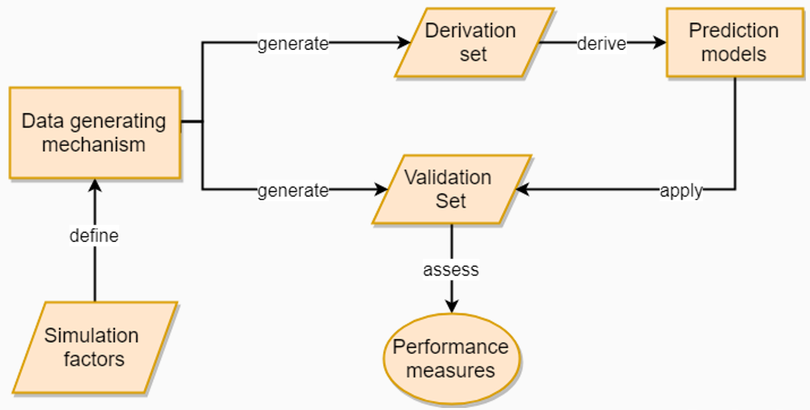

```{r setup, include = FALSE}
# packages
library(dplyr)
library(knitr)
library(xtable)

# settings
knitr::opts_chunk$set(echo = FALSE, message = FALSE, warning = FALSE)
```
\urlstyle{same} <!--ensure urls have the same style as the rest of the text-->

\maketitle <!--insert title-->

\subsection*{Abstract}
This replication report documents the replication attempt of the simulation study reported in Rhemtulla, Brosseau-Liard and Savalei (2012). The study compared two different estimation methods (robust Maximum Likelihood (ML) and categorical least squares (cat-LS)) for fitting confirmatory factor analysis models. Our replication included writing simulation code based on the information provided in the manuscript and supplemental material. Information provided in the original study was detailed and well structured thus allowing us to reimplement the study to the best of our knowledge. Detailed result tables provided in the supplemental material allowed us to compare our replicated results to the original results.
\vskip 2em

\noindent\makebox[\textwidth]{\large Correspondence concerning this replication report should be addressed to:}\par
\noindent\makebox[\textwidth]{\large a.l.lohmann@lumc.nl}\par

\clearpage

\section{Introduction}

This replication report documents the replication attempt of the simulation study

Rhemtulla, M., Brosseau-Liard, P. É., & Savalei, V. (2012). When can categorical variables be treated as continuous? A comparison of robust continuous and categorical SEM estimation methods under suboptimal conditions. *Psychological Methods*, 17(3), 354–373. https://doi.org/10.1037/a0029315

Following the definition of @rougier_sustainable_2017-1 we understand the replication of a published study as writing and running new code based on the description provided in the original publication with the aim of obtaining the same results.

\section{Method}

\subsection{Information basis}

The replication attempt was based on the information provided in the original manuscript as well as the supplemental material accompanying the publication. 
The main text provided a link to the supplements (http://dx.doi.org/10.1037/a0029315.supp) which referred to the website of the publisher where an additional pdf document with extensive result tables was freely available.
`<What sources were used to obtain information? The original article, some appendix, online supplements, other articles from the same authors, code available from the authors personal website?>`

\subsection{Data Generating Mechanism}
Information provided in the above mentioned sources indicated that the following simulation factors were systematically varied in a full-factorial design for generating the artificial data.

| Simulation factor | No. levels | Levels|
|------|--|-------|
| *Varied* |||
|CFA model size|2|10 indicators, 20 indicators||
|Underlying distribution|2| normal, non-normal||
|Number of categories| 6| 2,3,4,5,6,7||
|Threshold symmetry|5| symmetry, moderate asymmetry, moderate asymmetry alternative, extreme asymmetry| 
|Sample Size| 4| 100, 150, 350, 600| 
| *Fixed* |||

Data was generated according to these 480 simulation scenarios.
This was repeated for 1000 repetitions.


The data generating mechanism consisted of two steps.
(1) Data was generated based on the underlying distribution, CFA model and sample size.
(2) The generated data was categorized based on the given category thresholds corresponding to a given number of categories and threshold symmetry.

\subsubsection{CFA model}
The CFA models underlying data generation where described as "..." which we translated into the following matrices 


\subsubsection{Underlying distribution, CFA model size and Sample Size}
The original study indicated that "[c]ontinous data (normal and nonnormal) were generated in EQS (Version 6.1; Bentler,2008) 
using methods developed by Fleishman (1978) and Vale Maurelli (1983)."
We emulated this approach using the `generate()` function from the `simsem` package
with the parameter `inDist` set to `NULL` in the normal case and to `simsem::bindDist(skewness = 2, kurtosis = 7)` in the non-normal case.
This function also to the CFA model (as matrix ...) as well as the sample size as input constituing the first step of the data generation.


\subsubsection{Number of categories and Threshold symmetry}
`<More detail of how factor 3 was varied and implemented>`
After data was generated based on the given CFA model and the underlying distribution the resulting data was categorized into the number of categories for the scenario at hand. 
For each number of categories and each threshold symmetry Z-scores for category thresholds could be obtained from the first table of the supplemental material.
The sample covariance matrix of the resulting categorized data was tested for positive definiteness.
In case it was found to be non-positive definite data was resamples with a different seed until it was.
Additionally, it was ensured that non of the generated variables had zero variance.
These measures are not documented in the original study. 
Hence, we do not know whether or at which point in the simulation pipeline these issues were dealt with.


`<You can add pseudocode or a flowchart to illustrate the data generation or the entire simulation design>`
\begin{minipage}{\linewidth}
Data generation can be summarized with the following pseudo code:

\texttt{For 1000 repetitions of each of 480 unique scenarios:}
\begin{itemize}[leftmargin=*] 
	\item[--] \texttt{Sample data according to the given CFA model, sample size as well as underlying distribution of the scenario at hand.}
	\item[--] \texttt{Categorize data into the number of categories for the scenario at hand. Category thresholds depended on the threshold symmetry of a given scenario.}
	\item[--] \texttt{If any sample covariance matrix was not positive definitive, repeat sampling until it is.}
		\item[--] \texttt{Analyse data using a robust ML approach.}
		\item[--] \texttt{Analyse data using a robust ULS approach.}
		\item[--] \texttt{Remove results that ....}
		\item[--] \texttt{Obtain performance measures.}
	\begin{itemize}
	  \item[$\ast$] \texttt{Parameter estimates}
	  \item[$\ast$] \texttt{Bias.}
	  \item[$\ast$] \texttt{Compute ... based on these random elements.}
	  \item[$\ast$] \texttt{Determine ... based on mechanism of current scenario.}
	\end{itemize}
	\item[--] \texttt{If some condition is > x:}
	\begin{itemize}
	  \item[$\ast$] \texttt{Determine ... \& resample from corresponding ... model.}
	\end{itemize}
	\item[--] \texttt{Apply ...}
\end{itemize}
\end{minipage}
\newpage
\FloatBarrier <!-- ensure there are no plots in the references -->

\subsection{Investigated Methods}
The study compares the performance of robust normal theory maximum likelihood (ML) and robust categorical least squares (ULS) methodology for estimating confirmatory factor analysis (CFA) with ordinary variables.
The underlying CFA model was fit using each of the two methods under investigation.
`<Describe the methods that are investigated and how they are implemented>`

\subsubsection{Robust normal theory maximum likelihood (ML)}
CFA's were carried out using the `cfa()` function of the `lavaan` package.
For the *Robust normal theory maximum likelihood* approach we set the `estimator` parameter to `MLVM`.

`<Describe how the first method is defined and implemented. You can include equations and or R code. If applicable, mention specialized R packages, their version as well as, parameters of specific functions.>`

\subsubsection{Robust categorical least squares (ULS)}
The *Robust categorical least squares (ULS)* approach was also implemented using the `cfa()` function from the `lavaan` package.
In this case the `estimator` parameter was set to `ULSMV`. 
Additionally, the `ordered` parameter was set to `TRUE`.

`<Describe how the second method is defined and implemented. You can include equations and or R code. If applicable, mention specialized R packages, their version as well as, parameters of specific functions.>`

\subsection{Performance measures}
The two methods described above were compared on various performance measures.

\subsubsection{Convergence Failures}
\subsubsection{Improper solutions}
\subsubsection{Outliers}
The orinal study defined outliers as "any cases that produced a standard error greater than 1." 
We implemented this as the robust standard errors listed in the lavaan fit object.

\subsubsection{Parameter Estimates}
\subsubsection{Parameter Bias}
\subsubsection{Efficiency}
\subsubsection{Relative bias for robust standard errors}
\subsubsection{Coverage}
\subsubsection{Type I error rate}
\subsubsection{Outliers}


`<Describe which performance measures are compared, if applicable mention specialized R packages, their versions, as well as parameter settings of functions.>`

The following flowchart describes the simulation design
```{r, out.width='450pt', fig.cap= "Flow chart of data generating mechanism"}

```

\subsection{Technical implementation}
The original simulation study was carried out in EQS (Version 6.1) as well as Mplus (Version 6.11).
The authors of the original study report that data generation was carried out in EQS
and data analysis was conducted using both EQS as well as MPlus.
However, only results from the Mplus analysis are reported.
Our replication was implemented
using the R programming environment (details regarding software versions can be obtained from the section Reproducibility Information). 
The corresponding R code can be obtained from https://github.com/replisims/rhemtulla-2012. 
<!-- Add zenodo doi once obtained-->

The following table provides an overview of replicator degrees of freedom, 
i.e. decisions that had to be made by the replicators because of insufficient or contradicting information. 
Issues were resolved by discussion among the replicators. 
Decisions were based on what the replicators perceived to be the most likely implementation with likeliness estimated by common practice and/or guideline recommendations.
Wherever feasible multiple interpretations where implemented.

| Issue| Replicator decision| Justification |
|--------|--------|------|
| Data dependence| each scenario is implemented in independently generated data               | Best practice [@burton_design_2006]|  

\subsection{Data basis for Figures 1 and 2}
`<More details on how the information provided was insufficient, unclear or vague>`
*"Some weird quote from the original article that you could not make any sense of"* (p.XY)
We could not infer whether "for each condition" also included for each model size.
We interpreted the text such that this was the case and hence collapsed the distributions across both model sizes.
\subsection{Another issue}
`<More details on how the information provided was insufficient, unclear or vague>`
*"Some weird quote from the original article that you could not make any sense of"* (p.XY)

\section{Results}

\subsection{Replication of result figures}
\subsection{Simulation descriptives}
`<Describe the sampling distribution if any of the simulation parameters were sampled>`
The original study provides descriptives for the simulated data in two figures.
Figure 1 and Figure 2 of the original manuscript 

\subsection{Replication of result tables}
`<Compare any tabulated data to the original>`
Table 1 presents the "Skew and Kurtosis of Observed Categorical Variables by Threshold Distribution, Underlying Distribution, and Number of Categories" (p.363).
The "[v]alues in this table were obtained by generating samples of size N = 1,000,000 for each condition and recording the skew and kurtosis of the observed distributions." (p.363) As discussed above we understood "each condition" to also refer to the model size. 
Our results are hence pooled across model size.


\subsection{Replication of results presented in text form }
While the vast majority of results is presented in the form of figures,
a few outcomes regarding outliers, relative bias of parameter estimates as well as 
relative bias of robust standard errors are only communicated in text form.
`<If the text describes any results using words describe how that relates to your findings.>`

\subsubsection{Outliers}
The original study reports the frequency of outliers in the text.
There was one outlier in the original study.
In our replication we found ...

\subsubsection{Relative bias}
Figures and tables report absolute bias. 
Results pertaining to relative bias are only summarized in a more qualitative manner in text form.
"As the number of categories increases, ML estimates gradually become less biased and by five categories relative bias is always less than 10%.(p.362)"
"When the underlying distribution is non-normal, all cat-LS parameter estimates take on a slightly positive bias (around 4%), except when there are just two categories." (p.364)
"[B]ias is almost never greater that 5% with either method.

\subsubsection{Relative bias for robust standard error estimates}
 "ML standard errors are from 8% to 30% (average = 15%) smaller than empirical standard errors when the sample size is small, 
 and cat-LS standard errors are from 3% to 37% (average 13%) smaller than empirical standard errors when the sample size is small."
 "Cat-LS produces better robust standard errors for factor loadings, and ML produces better robust standard errors for factor correlations. This finding isconsistent across number od categories.

\FloatBarrier
\section{Discussion}

\subsection{Replicability}
Due to the high amount of details in the original publication and the corresponding supplemental materials the replication was straight forward.
The largest amount of time was spent ensuring that the methods used for data generation and analysis did indeed correspond to what was used in the original study.
This is, however, in no way the fault of the authors but rather due to limited documentation of the R packages used fro replication.
On the contrary the detailed description of the implementation allowed for a close correspondence of methodology which would have otherwise been left to guesswork.

A feature that deserves special praise with regards to facilitating replicability is the high amount of documentation that the authors dedicated to the generation of the
simulated data as well as the descriptives of the same.
The ability to closely monitor the data generation process and compare features of the simulated data to the original study instilled a great deal of confidence in the replicators and ensured that any potential deviations of results could not be attributed to faulty interpretation and implementation of the data generating mechanism.

Another feature that increased reproducibility was the structure of the manuscript.
The very first element of the method section was an overview of the simulation factors.
Readability was increased by listing each factor as a separate bullet point.
Subsequent sections detailed the implementation of each simulation factor.
A separate subheading for each simulation factor made it easy to locate relevant information.

The detailed description of error handling procedures as well as error descriptives ...

The large number of result tables presented in the supplemental material is another exemplary reporting practice worth highlighting.
While the comparison of hundreds of table cells is not an easy endeavor and the general interest in these tables likely limited
it protects the authors against any allegations of selective reporting and makes the assessment of replicability possible.

A similar structure could be found for the performance measures which were discussed in separate subsections separated by corresponding heading.
While very readable as is, we would have however preferred the performance measures to be elaborated on as part of the method section instead of
the result section. 

The introduction section included the presentation and discussion of several closely related methods as well as findings from previous studies investigating the same.
Due to the large amount of information surrounding highly similar methods and their implementation it took us several readings of the introduction to feel confident
about having identified the version actually implemented in the study at hand.
A clearer separation of the implemented methods (e.g. in a box) would have facilitated isolating the relevant implementation details.

Finally, a major factor facilitating the reproduction process was the availability of specialized SEM software in the R programming environment.
As R is frequently used for simulation studies investigating SEM methodology we were able to build upon a code base that was designed for this very purpose.
While such specialized software has the potential of huge time savings on the coding end and additionally is likely to minimize coding errors on the part of the replicator
it consumes a significant amount of time to familiarize oneself with the exact parameters underlying the tools.
The inexperienced user is at the mercy of the package documentation and the occasional peek under the hood of a given function. 
Having a code base from related simulation studies available would increase confidence in using such tools and avoid some trial and error while familiarizing oneself with the functionalities.

`<Provide a general statement of how you experienced the replication process. Was it easy? What made it easy or difficult?>`

\subsection{Replicator degrees of freedom}
`<Here you can discuss the replicator degrees of freedom. What could the authors have done to make it more clear? Do you think the replicator degrees of freedom are so extensive that they could influence the results?>`

\subsection{Equivalence of results}
`<How would you judge the overall equivalence of results? Are the orders of magnitude comparable? Are trends in the same direction? Would you draw the same conclusions as the authors based on your replication? Were some results not comparable because of insufficient figure resolution or labeling? Did the authors ommit some results which consequently cannot be compared?>`


\section{Acknowledgments}
`<Acknowledge the help of anyone who assisted you in the process>`

\section{Contributions}
Authors made the following contributions according to the CRediT framework https://casrai.org/credit/

Anna Lohmann:

- Data Curation  
- Formal Analysis (lead)  
- Investigation  
- Software  
- Visualization (lead)  
- Writing - Original Draft Preparation  
- Writing - Review & Editing  

Arjan Huizing:

- Formal Analysis (supporting)  
- Investigation  
- Software (supporting)  
- Visualization (supporting)  
- Validation  
- Writing - Review & Editing   

\newpage

\section*{References}
\begingroup
\hphantom{x}
\setlength{\parindent}{-0.5in}
\setlength{\leftskip}{0.5in}
<div id="refs" custom-style="Bibliography"></div>
\FloatBarrier
\endgroup
\newpage

\section*{Appendix}

\subsection*{Additional result}
`<insert additional results not reported in the original article or results presented in an alternative way>`

\subsection{Code organization}


The code and the files associated are organized in the form of a research compendium
which can be found in the following git repository `https://github.com/replisims/rhemtulla-2012`


```{r code_structure, cache = FALSE}
# which R packages and versions?
if ("fs" %in% installed.packages()) fs::dir_tree(path = ".", recurse = TRUE)
```


- `foldername`: contains `<insert description>`
- `filename`: contains `<insert description>`
- ...

\subsubsection*{Reproducibility Information}

This report was last updated on `r Sys.time()`. 
The simulation replication was conducted using the following computational environment and dependencies: 

\FloatBarrier
```{r colophon, cache = FALSE}
# which R packages and versions?
if ("devtools" %in% installed.packages()) devtools::session_info()
```

The current Git commit details are:

```{r git}
# what commit is this file at? 
if ("git2r" %in% installed.packages() & git2r::in_repository(path = ".")) git2r::repository(here::here())  
```
